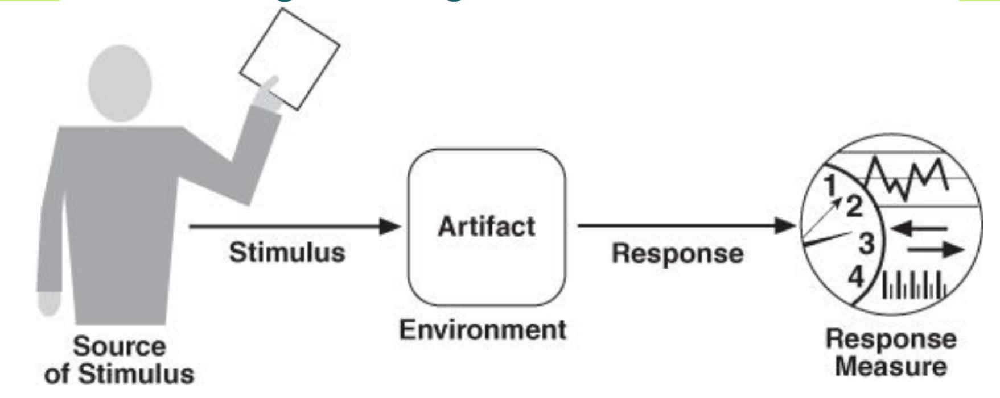

# 12-质量属性

## 需求

* 功能性需求：定义了**系统必须做什么**，强调了**系统如何提供价值**给涉众
* 非功能性需求/质量需求：在功能需求之上，系统应提供的**合乎需要的特性**（质量属性）
  * 内部质量属性：和开发人员有关，比如：可修改性、可维护性
  * 外部质量属性：和用户有关，比如：性能，可用性
* 约束：预先确定的设计约束，如成本、时间、技术、法规、标准等

## 使用场景建模质量属性

<figure><figcaption>
使用场景建模质量属性
</figcaption></figure>

* Stimulus 刺激：到达系统时需要考虑的条件
* Source of Stimulus 刺激源：产生刺激的实体（人，系统或任何促动器）
* Response 响应：刺激措施到来之后开展的活动
* Response Measure 响应度量：对响应的量化度量
* Environment 环境：发生刺激时系统的状况，如开发时、运行时、过载时
* Artifact 工件：整个系统/系统的一部分

| 质量属性             | 刺激源           | 刺激         | 工件     | 环境      | 响应           | 响应度量                     |
| ---------------- | ------------- | ---------- | ------ | ------- | ------------ | ------------------------ |
| Availability     | Heartbeat 监视器 | 服务器无响应     | 处理器    | 正常操作    | 通知操作者继续操作    | 没有停机时间                   |
| Interoperability | 车辆信息系统        | 发送当前位置     | 路况监控系统 | 系统运行前已知 | 路况监控系统成功接收请求 | 99.9% 的信息交换被正确处理         |
| Modifiability    | 开发者           | 希望修改 UI 界面 | 代码     | 设计时     | 进行修改和单元测试    | 在 3 小时内完成                |
| Performance      | 用户            | 发起事务       | 系统     | 正常操作    | 事务被处理        | 平均延迟不超过 2 秒              |
| Security         | 攻击者           | 尝试修改支付率    | 系统内数据  | 正常操作    | 系统识别攻击请求被拦截  | 识别时间小于 50 毫秒，在 5 分钟内完成上报 |
| Testability      | 单元测试者         | 单元测试完成     | 单元测试代码 | 开发时     | 记录结果         | 3 小时内达到 85% 的路径覆盖        |
| Usability        | 用户            | 使用新应用      | 系统     | 运行时     | 用户高效地使用应用    | 在 2 分钟内达成                |

## Strategy / Tactics / Patterns / Styles

* Tactics 战术：影响系统对质量属性的响应的设计决策
* Architectual strategy 架构策略：Tactics 的集合
* Style 和 Pattern 应用战术来提供预期的好处

> 架构模式和策略之间的关系
>
> * 策略比架构模式更简单
> * 架构模式通常由许多策略组合在一起
> * 策略和架构模式共同构成软件设计的工具

## 具体质量属性

### Availability 可用性

* 定义：系统能正常运行的时间百分比
* 决定可用性损失的因素：发现故障、纠正故障、重启应用的耗时
* 计算方式：$\frac{\text{MTBF\}}{\text{MTBF} + \text{MTTR\}}$
  * MTBF：平均故障间隔
  * MTTR：平均维修时间
* SLA：服务商承诺达到的可用性水平的协议
* 战术
  * 故障检测：Ping / Echo、心跳、异常
  * 故障恢复：Voting、主动冗余、被动冗余……

### Interoperability 互操作性

* 定义：系统间通过特定上下文中的接口，有效交换有意义的信息的能力
  * 语法互操作性：交换数据的能力
  * 语义互操作性：正确解释数据的能力
* 两个重要方面：发现服务、处理请求
* 战术
  * 定位：服务发现
  * 管理接口

### Modifiability 可修改性

* 定义：有关更改、做出更改的时间和金钱成本、更改对其他功能和质量属性的影响的质量属性
* 战术：
  * 拆分模块
  * 增加语义内聚
  * 减少耦合
  * 延迟绑定：在不同的阶段绑定某些参数的值，避免过早绑定，将决定推迟到部署/运行阶段

### Performance 性能

* 定义：关于时间和软件系统满足时序要求的能力
* 响应时间的构成：处理时间、阻塞时间
* 战术
  * 需求侧：限制事件响应、优先处理更重要的请求、使用中间层优化处理流程
  * 资源侧：增加资源数量、性能、提升并发性、负载均衡、缓存

### Security 安全性

* 定义：衡量系统保护数据和信息**免遭未授权访问**，同时仍提供**对授权人员和系统的访问**的能力
* 三个特征：CIA
  * Confidentiality 保密性：防止未授权访问数据和服务
  * Integrity 完整性：数据和服务不会受到未经授权的操纵
  * Availability 可用性：系统将可供合法使用
* 战术：身份验证、授权、加密、审计和监控

### Testability 可测试性

* 定义：通过测试来**证明软件存在故障的难易程度**
* 战术
  * 控制和观察系统状态：维护状态信息，使测试人员能按需访问状态并对其赋值
    * 专用接口：用来控制或捕获组件的值
    * 记录/回放：找到导致故障的状态并复现
    * 沙盒：将系统的实例与现实世界隔离开来，避免实验的后果
  * 限制软件复杂度

### Usability 易用性

* 定义：用户完成任务的**难易程度**以及系统提供的**用户支持**的类型
  * 如：学习系统功能、高效使用系统、最小化错误的影响、使系统适应用户需求、增强信心和满意度
* 战术
  * 支持用户主动行为：支持用户纠正错误/提高效率
  * 支持系统主动行为
    * 维护**任务模型**：确定**上下文**，使系统了解用户的尝试并提供帮助
    * 维护**用户模型**：代表用户对系统的知识
    * 维护**系统模型**：确定预期的系统行为，以便向用户提供适当的反馈
