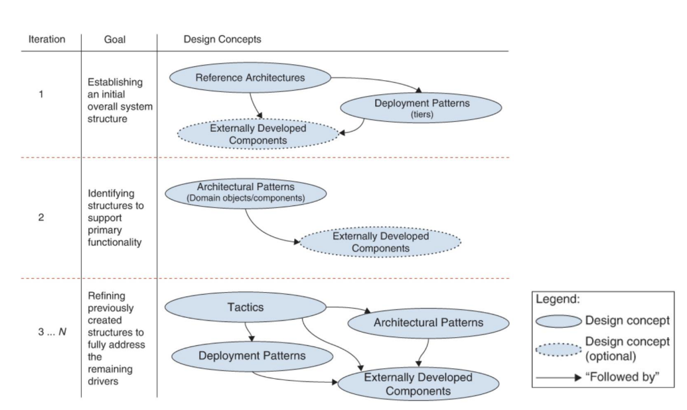
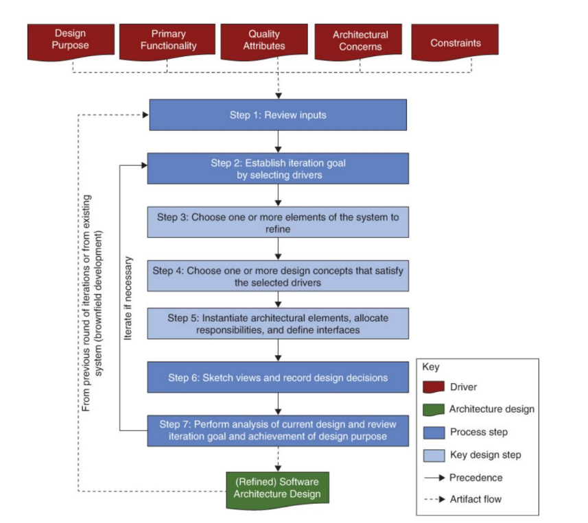

# 14-ADD

## 架构驱动因素

* 需求
  * 功能需求：支持业务目标的主要功能
  * 质量属性
  * 约束：时间、预算、技术限制、业务规定
* 其他因素
  * 系统的类型：新领域的 Greenfield 系统、成熟领域的 Greenfield 系统、Brownfield 系统
  * 设计目标
  * 架构关注点
    * 通用关注点：宏观的架构设计
    * 特定关注点：系统层面的技术细节
    * 内部需求：内部实现的细节
    * Issues：性能/安全瓶颈带来的架构演进

## 搭建新系统的 Roadmap

<figure><figcaption>
搭建新系统的 Roadmap
</figcaption></figure>

| 迭代   | 目标              | 设计概念                  |
| ---- | --------------- | --------------------- |
| 1    | 建立初始化的整体架构      | 参考架构、部署模式（可选：外部开发的组件） |
| 2    | 识别支持主要功能的架构     | 架构模式（可选：外部开发的组件）      |
| 3..N | 迭代优化架构以支持其余驱动因素 | 策略、架构模式、部署模式、外部开发的组件  |

## ADD 3.0 流程

<figure><figcaption>
add 3.0 流程图
</figcaption></figure>

* 输入（架构驱动因素）：设计目的、主要功能、质量属性、架构关注点、约束
* 输出：优化后的架构设计

### 流程

1. 审阅输入：包含已有的架构设计和输入
2. 选择驱动因素，确定本轮**迭代目标**：根据迭代轮次，对应 Roadmap 中的迭代目标
3. 选择系统中**需要改进的**一个或多个**元素**
   * 改进的方式：分解、组合、改进某个部分
   * 对于 Greenfield 系统：建立系统的上下文、分解系统本身
4. 识别并选择满足该驱动因素的**设计概念**：根据迭代轮次，从 Roadmap 中的设计概念中选择
5. **实例化**架构元素、分配职责、定义接口
6. **绘制**架构视图，**记录**设计决策
7. 分析当前设计，**评估**迭代目标，评估是否达到设计目标
   * 若继续迭代，则回到第二步

## 架构文档化

### 概述

* 架构文档必须：透明、具体、包含充分信息
* 架构文档具有规范性和描述性
  * 规定应当成立的内容，对尚未作出的决策施加约束
  * 描述已经做出的决策
* 用途
  * 教育：用户、新团队成员、外部分析师、新架构师
  * 利益相关者间的主要沟通工具
  * 系统分析和构建的基础

### 视图

* 视图将软件架构划分为若干可管理的表示
* 结构视图：模块视图、C\&C 视图、分配视图
* 质量视图
* 至少需要一个模块视图和一个 C\&C 视图，对于大系统至少需要一个分配视图

#### 模块视图

* 记录模块和代码层面的组织
* 元素：模块（软件的实现单元，提供连贯的职责）
* 关系
  * Is part of：子模块和聚合模块的整体/部分关系
  * Depends on：模块之间的依赖关系
  * Is a：子模块和父模块的关系
* 约束：模块间的拓扑约束，如模块间的可见性

#### C\&C 视图（Component and Connector View）

* 记录系统运行时由哪些计算单元组成，以及它们如何通信
* 元素
  * 组件：处理、存储数据的单元，拥有和别的组件交互的**端口**，如进程、对象、客户端、服务器
  * 连接器：组件之间的通信路径，通过**角色**规定组件如何使用连接器
* 关系
  * Attachments：将组件的端口和连接器的角色绑定在一起
  * 接口委派：将一个组件/连接器包含更小的子架构时，外层元素的端口委派给内层元素的端口
* 约束
  * 组件只能和连接器连接，连接器只能和组件连接
  * Attachment 和接口委派只能连接兼容的端口和角色
  * 连接器不能单独出现，必须与组件相连接

#### 分配视图

* 描述了软件单元到软件开发或执行环境元素的映射
* 元素：软件、环境
  * 软件对环境有要求，环境向软件提供能力
* 关系
  * 分配：软件单元被分配到环境元素上
* 约束：因视图而变化

#### 质量视图

* 包括：安全视图、沟通视图、性能视图、可靠性视图、异常（错误）处理视图

### 选择视图步骤

1. 构建涉众/视图表：行为涉众，列为视图，格子填写涉众对视图的细节了解程度。
2. 合并视图：寻找边缘视图，和具有更强表示能力的视图结合
3. 确定优先级和完成阶段

### 构建架构文档

* 视图 + 视图以外的文档

#### 视图

1. 主要介绍：显示视图的元素和关系，以及图例
2. 元素介绍：详细介绍第一部分中描述的元素、元素属性、关系属性和元素接口和行为
3. 上下文图：描述系统如何与环境相关
4. 可变性指南：告知视图中可能发生的变化
5. 基本原理：为什么设计反映在视图中，并且说明其合理性

#### 视图以外的文档

1. 文档路线图：说明文档中的信息，以及可以在哪里找到
2. 如何文档化视图
3. 系统概览
4. 视图间映射
5. 基本原理：描述应用到视图上的架构决策
6. 目录
7. 文档控制信息
