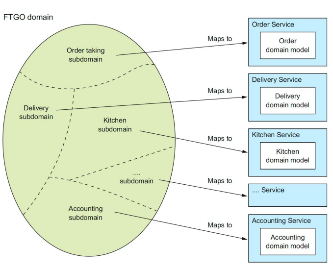

# 15-微服务模式

* 定义：将一个单一应用开发为一组小型服务的方法，每个服务运行在自己的进程中，服务间采用轻量级通信机制，这些服务围绕业务能力构建，通过自动部署机制独立部署。

|       | SOA             | MSA                                  |
| ----- | --------------- | ------------------------------------ |
| 服务间通信 | 智能管道（ESB），重量级协议 | 哑管道（消息代理或服务间点对点通信），轻量级协议（REST, gRPC） |
| 数据管理  | 全局数据模型并共享数据库    | 每个服务有自己的数据模型和数据库                     |
| 规模    | 较大的单体应用         | 较小的服务                                |

## 特点

* 通过服务组件化
* 围绕业务能力组织，而不是聚焦在技术层面
* 服务内部高内聚，服务间低耦合
* 去中心化：治理、数据存储、数据管理
* 基础设施自动化
* 高可用性设计、演进式设计

## 拆分

### 步骤

1. 定义系统操作：将需求提炼为系统必须处理的关键请求 / 由抽象的领域模型定义
2. 定义微服务：根据业务能力/子域拆分
3. 定义服务 API 和协作方式

### 定义系统操作

1. 分析用户故事中频繁出现的名词，创建（抽象的）领域模型
   * 需提取关联类及类中的属性
2. 分析用户故事和场景中的动词，确定系统操作
   * 命令型（增删改）/查询型（查）
   * 需给出
     * 系统操作指令：Actor，Story，Command，Description（如`(客户，创建订单，createOrder()，创建一个订单)`）
     * 系统操作规范：参数，返回值，前置条件，后置条件

### 定义微服务

#### 根据业务能力拆分

* 基于需求找到业务能力，将顶级能力/子能力映射到不同服务上

```
供应商管理 # 顶级能力，看上去是特别宽泛的需求
  送餐员信息管理 # 子能力，看上去是比较宽泛的需求 -> 供应商服务
  餐馆和其他信息管理 -> 餐馆服务
消费者管理 -> 消费者服务
订单获取和履行
  创建和管理订单 -> 订单服务
  餐馆管理订单生产过程 -> 厨房服务
  送餐 -> 以下三个均为配送服务
  送餐员实时状态管理
  配送管理
会计记账 -> 会计服务
  管理消费者相关的会计记账
  管理餐馆相关的会计记账
  管理送餐员相关的会计记账
其他
```

#### 根据子域拆分

* 将整个域分为若干个 Subdomain，每个 Subdomain 对应微服务和领域模型

<figure><figcaption><p>根据子域拆分微服务</p></figcaption></figure>

### 定义服务 API 和协作方式

1. 将系统操作分配给服务：分配给需要操作提供信息的服务
2. 确定支持协作的API

> 输出的表格包含 `(服务，操作，协作者)`

| Service          | Operations                | Collaborators                                                                                                                                                                                                                      |
| ---------------- | ------------------------- | ---------------------------------------------------------------------------------------------------------------------------------------------------------------------------------------------------------------------------------- |
| Consumer Service | `verifyConsumerDetails()` | —                                                                                                                                                                                                                                  |
| Order Service    | `createOrder()`           | <p>- Consumer Service: <code>verifyConsumerDetails()</code><br>- Restaurant Service: <code>verifyOrderDetails()</code><br>- Kitchen Service: <code>createTicket()</code><br>- Accounting Service: <code>authorizeCard()</code></p> |

## 通信模式

### 应用层服务发现模式

* 目的：客户端需要发现服务实例的位置
* 自注册：服务实例调用服务注册表的注册API来注册其网络位置
* 客户端发现：客户端查询服务注册表以获取服务实例的列表
* 优点：与部署平台无关
* 缺点：每种语言都要单独实现发现逻辑

### 平台层服务发现模式

* 目的：客户端需要发现服务实例的位置
* 第三方注册：由第三方负责（注册服务器，通常是部署平台的一部分）处理注册
* 服务端发现：客户端无需查询服务注册表，向 DNS 名称发出请求，请求被解析到路由器，路由器查询服务注册表并对请求进行负载均衡。
* 优点：多语言支持，客户端和服务端无需额外代码
* 缺点：存在平台约束

### API Gateway 模式

* 目的：处理客户端和服务之间的通讯
* 位于客户端和服务之间，作为客户端的单一入口点，提供不同客户端的不同 API
* 优点：封装内部结构，减少往返次数；确保客户端不受服务实例位置影响
* 缺点：性能和可扩展性，局部故障

### 断路器模式

* 目的：避免故障蔓延到其他服务
* 三种状态
  * 闭合：请求能直接调用方法，系统正常运转
  * 断开：立即返回错误响应，当失败率或响应时间超过阈值时触发
  * 半断开：允许一定数量的请求调用服务，若成功切换到闭合，若失败切换到断开

## 部署模式

* 主要考**将服务部署到容器**：将服务打包为 Docker 镜像并将每个服务实例部署到容器
* 部署过程：构建镜像 -> 运行镜像
* 优点：扩缩容方便，封装技术细节，实例隔离，可限制硬件资源，构建和启动速度快

## 可观测性模式

* **日志聚合**：使用集中式日志记录服务，聚合来自每个服务实例的日志
* **审计日志**：记录用户执行的操作
* **应用程序指标**：检测服务以收集有关各个操作的统计信息，在集中式指标服务中聚合指标，提供报告和警报
* **分布式跟踪**：监控跨服务调用的请求路径
* **异常跟踪**：聚合和跟踪异常，并通知开发人员
* **健康检查 API**：提供 `/health` API，返回服务的健康状态，定期 ping API 以检查健康状态
